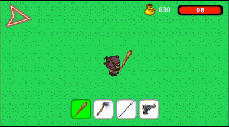

### 2D Open World RPG Game

## Controls
|     Key     |     Behaviour    |
|-------------|------------------|
| F5          |        Save      |
| Right click | Move to position |
| Space       | Attack on either positive or negative x direction |
| ESC         | Pause |
| W           | Hold player position. |

## Features
- Playerprefs save system. Saves only player's and bosses' position, health and gold amount for player. 
Other enemies are instantiated on each start.
- TerrainLocator: Enemies have a script for patrolling. They are assigned a position to go but that position is 
restricted within their own terrain. That is handled by casting 16 different angled rays to count the terrain 
colliders. Terrains have tilemap collider and they intersect each other at some parts. That's why 16 different
rays are needed to avoid wrong terrain selection.
- Player can have 4 different weapon throughout the game. Starts with club. Others can be purchased later on.
  1. Club, lowest damage, low range.  
  
  2. Axe, highest damage, low range.  
  
  3. Spear, moderate damage, high range.  
    
  4. Pistol, lowest damage, huge range.  
  

- There are three different terrains(forest, desert, arctic). Each terrain has 2 distinct enemy type. All enemies have some 
lock up time to the target(player in their case) before attacking. Each terrain features its own boss, whose
attack pattern is a combination of the distinct attack patterns of the two enemy types native to that terrain.  
**Map**    
  
  - **Forest enemies;**
    - Glutterfly attack pattern: Throws a projectile to that position.
    - Booby attack pattern: Leaps into the air in a smooth arc, following a projectile motion trajectory.  
    
    - BoobyBoss;  
     
  - **Desert enemies;**
    - Kamikazzy attack pattern: Follows target to a distance then explode on the area after a brief moment.  
    
    - Tartil attack pattern: Shoots a projectile in a smooth arc targeted to player position. Projectile covers 
      an area for some time and damages the player while the player is on it.  
    
    - BossTartil;  
     
  - **Arctic enemies;**
    - SlidingThing attack pattern: Slides to the player position and damaging the player.  
    
    - Mushroom attack patterns;
      1. Throws 2 projectiles to the opposite directions. One is targeted to player.
      2. Holds for a moment to blast within a radius, and damaging all in that area.  
    
    - BossMushroom;  
     